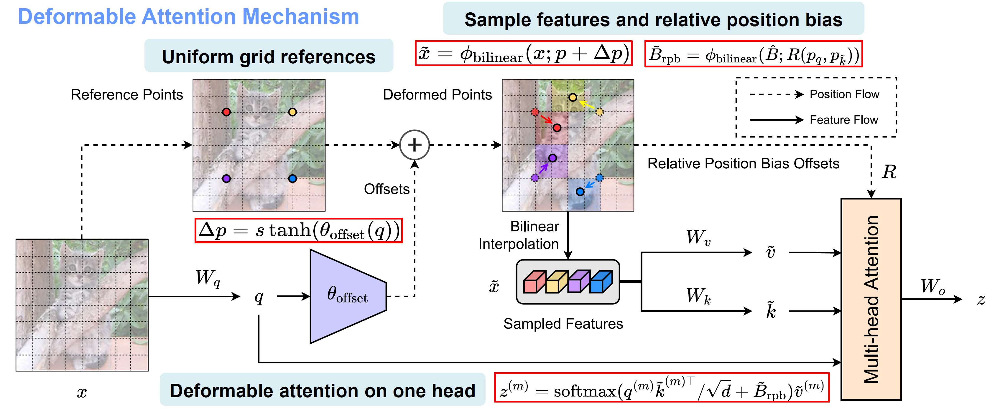

# Vision Transformer with Deformable Attention

This repository contains the code for the paper Vision Transformer with Deformable Attention (CVPR2022) \[[arXiv](https://arxiv.org/abs/2201.00520)\]\[[video](https://cloud.tsinghua.edu.cn/f/17476d769ced48eaa278/)]\[[poster](https://cloud.tsinghua.edu.cn/f/9afe817efb504d32951b/)\]. 

## Introduction

### Motivation


**(a) Vision Transformer(ViT)** has proved its superiority over many tasks thanks to its large or even global receptive field. However, this global attention leads to excessive computational costs. **(b) Swin Transformer** proposes shifted window attention, which is a more efficient sparse attention mechanism with linear computation complexity. Nevertheless, this hand-crafted attention pattern is likely to drop important features outside one window, and shifting windows impedes the growth of the receptive field, limiting modeling the long-range dependencies. **(c) DCN** expands the receptive fields of the standard convolutions with the learned offsets for each different query. Howbeit, directly applying this technique to the Vision Transformer is non-trivial for the quadratic space complexity and the training difficulties. **(d) Deformable Attention (DAT)** is proposed to model the relations among tokens effectively under the guidance of the important regions in the feature maps. This flexible scheme enables the self-attention module to focus on relevant regions and capture more informative features.


### Method



By learning several groups of offsets for the grid reference points, the deformed keys and values are sampled from these shifted locations. This deformable attention can capture the most informative regions in the image. On this basis, we present **Deformable Attention Transformer (DAT)**, a general backbone model with deformable attention for both image classification and other dense prediction tasks. 

### Visualizations


Visualizations show the most important keys denotes in orange circles, where larger circles indicates higher attention scores. That the important keys cover the main parts of the objects demonstrates the effectiveness of  DAT.

## Dependencies

- NVIDIA GPU + CUDA 11.3
- Python 3.9 (\>=3.6, recommend to use Anaconda)
- cudatoolkit == 11.3.1
- PyTorch == 1.11.0
- torchvision == 0.12.0
- numpy
- timm == 0.5.4
- einops
- PyYAML
- yacs
- termcolor

## Evaluate Pretrained Models

We provide the pretrained models in the tiny, small, and base versions of DAT, as listed below.

| model  | resolution | acc@1 | config | pretrained weights |
| :---: | :---: | :---: | :---: | :---: |
| DAT-Tiny | 224x224 | 82.0 | [config](configs/dat_tiny.yaml) | [GoogleDrive](https://drive.google.com/file/d/1I08oJlXNtDe8jJPxHkroxUi7lYX2lhVc/view?usp=sharing) / [TsinghuaCloud](https://cloud.tsinghua.edu.cn/f/1367349deefc48efa650/) |
| DAT-Small | 224x224 | 83.7 | [config](configs/dat_small.yaml) | [GoogleDrive](https://drive.google.com/file/d/1UUmQqQYY5OInVuXvUgO41Gice93vJ0A7/view?usp=sharing) / [TsinghuaCloud](https://cloud.tsinghua.edu.cn/f/f04b18081e3e4606adb7/) |
| DAT-Base | 224x224 | 84.0 | [config](configs/dat_base.yaml) | [GoogleDrive](https://drive.google.com/file/d/1Avu16r59koxizoSYhfaCdNdr-QxLVGjd/view?usp=sharing) / [TsinghuaCloud](https://cloud.tsinghua.edu.cn/f/a8d2a9645d454120b635/) |
| DAT-Base | 384x384 | 84.8 | [config](configs/dat_base_384.yaml) | [GoogleDrive](https://drive.google.com/file/d/1m8E2U4iQ6EOe1e8SuAGPbPlPhISXnVWq/view?usp=sharing) / [TsinghuaCloud](https://cloud.tsinghua.edu.cn/f/cf6a6b543cd64e0d8e43/) |

To evaluate one model, please download the pretrained weights to your local machine and run the script `evaluate.sh` as follow.

```
bash evaluate.sh <gpu_nums> <path-to-config> <path-to-pretrained-weights>
```

E.g., suppose evaluating the DAT-Tiny model (`dat_tiny_in1k_224.pth`) with 8 GPUs, the command should be:

```
bash evaluate.sh 8 configs/dat_tiny.yaml dat_tiny_in1k_224.pth
```

And the evaluation result should give:

```
[2022-06-07 04:08:50 dat_tiny] (main.py 288): INFO  * Acc@1 82.034 Acc@5 95.850
[2022-06-07 04:08:50 dat_tiny] (main.py 150): INFO Accuracy of the network on the 50000 test images: 82.0%
```

Outputs of the other models are:

```
[2022-06-07 04:19:42 dat_small] (main.py 288): INFO  * Acc@1 83.686 Acc@5 96.392
[2022-06-07 04:19:42 dat_small] (main.py 150): INFO Accuracy of the network on the 50000 test images: 83.7%

[2022-06-07 04:24:35 dat_base] (main.py 288): INFO  * Acc@1 84.028 Acc@5 96.686
[2022-06-07 04:24:35 dat_base] (main.py 150): INFO Accuracy of the network on the 50000 test images: 84.0%

[2022-06-07 06:43:07 dat_base_384] (main.py 288): INFO  * Acc@1 84.754 Acc@5 96.982
[2022-06-07 06:43:07 dat_base_384] (main.py 150): INFO Accuracy of the network on the 50000 test images: 84.8%
```

## Train Models from Scratch

To train a model from scratch, we provide a simple script `train.sh`. E.g, to train a model with 8 GPUs on a single node, you can use this command:

```
bash train.sh 8 <path-to-config> <experiment-tag>
```

We also provide a training script `train_slurm.sh` for training models on multiple machines with a larger batch-size like 4096. 

```
bash train_slurm.sh 32 <path-to-config> <slurm-job-name>
```

**Remember to change the \<path-to-imagenet\> in the script files to your own ImageNet directory.**

## TODO

- [x] Classification pretrained models.
- [ ] Object Detection codebase & models.
- [ ] Semantic Segmentation codebase & models.
- [ ] CUDA operators to accelerate sampling operations.

## Acknowledgements

This code is developed on the top of [Swin Transformer](https://github.com/microsoft/Swin-Transformer), we thank to their efficient and neat codebase. The computational resources supporting this work are provided by [Hangzhou
High-Flyer AI Fundamental Research Co.,Ltd](https://www.high-flyer.cn/).

## Citation

If you find our work is useful in your research, please consider citing:

```
@InProceedings{Xia_2022_CVPR,
    author    = {Xia, Zhuofan and Pan, Xuran and Song, Shiji and Li, Li Erran and Huang, Gao},
    title     = {Vision Transformer With Deformable Attention},
    booktitle = {Proceedings of the IEEE/CVF Conference on Computer Vision and Pattern Recognition (CVPR)},
    month     = {June},
    year      = {2022},
    pages     = {4794-4803}
}
```

## Contact

If you have any questions or concerns, please send mail to [xzf20@mails.tsinghua.edu.cn](mailto:xzf20@mails.tsinghua.edu.cn).
